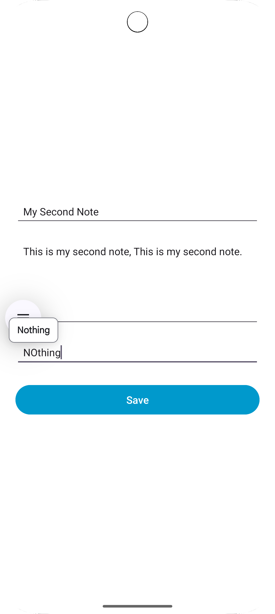

# Simple sample app to connect to backend app with MongoDB Atlas
(Informative APP only on working with Backend Flask APP with MongoDB Atlas and Android App)
Backend code here: https://github.com/dgdeakin/DTask10_1_MongoDBAtlas

# To run the code:
- Just clone or download the project.
- Run the backend code first and then run this app.

# Output:

  
  
  

# Resources:
1. Android JSONObject - JSON Parsing in Android
   https://www.digitalocean.com/community/tutorials/android-jsonobject-json-parsing
2. What is a CRUD App & How to Build One in 3 Steps
   https://budibase.com/blog/crud-app/
3. https://developer.android.com/reference/android/widget/ListView
4. Volley overview - Volley Library
   https://google.github.io/volley/
5. https://medium.com/@ashwini.bandi524/mastering-android-networking-with-volley-library-in-java-874705103ffc
6. https://google.github.io/volley/simple.html